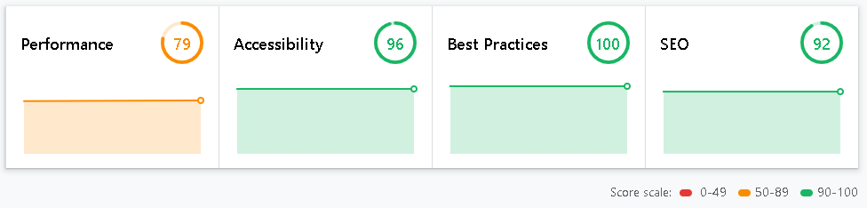

# Desafio Final - Go Beyond, patrocinado pela Corebiz

projeto feito com React, como desafio final do curso Go Beyond. Treino para utilizar hooks e informações vindas de uma API, criada com https://jsonplaceholder.typicode.com/

## Instalação

Para utilizar o projeto em sua máquina local, baixe os arquivos e digite `npm install` no terminal.  

## Rodando o projeto

Utilize o comando `npm start` no terminal para abrir o projeto em [http://localhost:3000](http://localhost:3000)

## Prévia do projeto

## Features para implementar

- [ ] Container de thumbs na tela mobile deveria ser embaixo do card grande (selecionado)
- [ ] Animação de fechar e abrir o menu hambúrguer
- [ ] Seta de "next page" ao lado do botão "veja mais
- [X] Melhora de performance

## Link do deploy na vercel: https://finalchallenge-gobeyond2-av.vercel.app/

## Informações de performance, segundo site https://web.dev/

